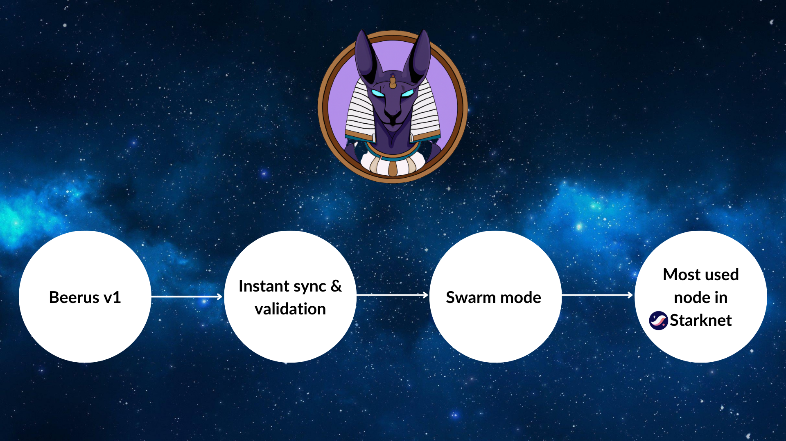

<div align="center">
  <h1>Beerus</h1>
    
  <br />
  <br />
  <a href="https://github.com/keep-starknet-strange/beerus/issues/new?assignees=&labels=bug&template=01_BUG_REPORT.md&title=bug%3A+">Report a Bug</a>
  -
  <a href="https://github.com/keep-starknet-strange/beerus/issues/new?assignees=&labels=enhancement&template=02_FEATURE_REQUEST.md&title=feat%3A+">Request a Feature</a>
  -
  <a href="https://github.com/keep-starknet-strange/beerus/discussions">Ask a Question</a>
</div>

<div align="center">
<br />

[](https://github.com/keep-starknet-strange/beerus/actions/workflows/check.yml)
[](LICENSE)
[](https://github.com/keep-starknet-strange/beerus/issues?q=is%3Aissue+is%3Aopen+label%3A%22help+wanted%22)

</div>

<details>
<summary>Table of Contents</summary>

- [Report a Bug](#report-a-bug)
- [Request a Feature](#request-a-feature)
- [Roadmap](#roadmap)
- [About](#about)
  - [Built With](#built-with)
- [Architecture](#architecture)
  - [Simple usage overview](#simple-usage-overview)
- [Endpoint support](#endpoint-support)
- [Getting Started](#getting-started)
  - [Installation](#installation)
    - [Beerusup](#beerusup)
    - [Build](#build)
    - [Test](#test)
    - [Config](#config)
      - [Config File](#config-file)
      - [Environment Variables](#environment-variables)
    - [Beerus RPC](#beerus-rpc)
      - [Beerus RPC](#beerus-rpc-1)
      - [Beerus JS(wasm demo)](#beerus-jswasm-demo)
- [Work in progress](#work-in-progress)
- [Support](#support)
- [Project assistance](#project-assistance)
- [Contributing](#contributing)
- [Security](#security)
- [Acknowledgements](#acknowledgements)
- [Contributors ✨](#contributors-)

</details>

---
## Roadmap
We have big plans for Beerus. Check out the Roadmap!

[](docs/images/roadmap.png)
## About

Beerus is a StarkNet Light Client inspired by and using
[helios](https://github.com/a16z/helios/). The goal is to provide a simple and
easy to use client to query StarkNet state and interact with contracts.

### Built With

- [Rust](https://www.rust-lang.org/)
- [helios](https://github.com/a16z/helios)
- [ethers-rs](https://github.com/gakonst/ethers-rs)

## Architecture

Here is a high level overview of the architecture of Beerus.

[](docs/images/beerus-architecture-v1.0.png)

### Simple usage overview

Here is a simple overview of how Beerus work. The example is for querying a
storage value of a StarkNet contract.

[](docs/images/query-contract-storage.png)

## Endpoint support

Here are all the endpoints supported by Beerus in tag v0.2.0

*Starknet endpoints* (in compliance with [Starknet specs](https://playground.open-rpc.org/?uiSchema%5BappBar%5D%5Bui:splitView%5D=false&schemaUrl=https://raw.githubusercontent.com/starkware-libs/starknet-specs/master/api/starknet_api_openrpc.json&uiSchema%5BappBar%5D%5Bui:input%5D=false&uiSchema%5BappBar%5D%5Bui:darkMode%5D=true&uiSchema%5BappBar%5D%5Bui:examplesDropdown%5D=false)):

| Endpoint                                   | Supported          |
| :----------------------------------------- | :----------------- |
| `starknet_getBlockWithTxHashes`            | :white_check_mark: |
| `starknet_getBlockWithTxs`                 | :white_check_mark: |
| `starknet_getStateUpdate`                  | :white_check_mark: |
| `starknet_getStorageAt`                    | :x:                |
| `starknet_getTransactionByHash`            | :white_check_mark: |
| `starknet_getTransactionByBlockIdAndIndex` | :white_check_mark: |
| `starknet_getTransactionReceipt`           | :white_check_mark: |
| `starknet_getClass`                        | :white_check_mark: |
| `starknet_getClassHashAt`                  | :white_check_mark: |
| `starknet_getClassAt`                      | :white_check_mark: |
| `starknet_getBlockTransactionCount`        | :white_check_mark: |
| `starknet_call`                            | :x:                |
| `starknet_estimateFee`                     | :white_check_mark: |
| `starknet_blockNumber`                     | :white_check_mark: |
| `starknet_blockHashAndNumber`              | :white_check_mark: |
| `starknet_chainId`                         | :white_check_mark: |
| `starknet_pendingTransactions`             | :white_check_mark: |
| `starknet_syncing`                         | :white_check_mark: |
| `starknet_getEvents`                       | :white_check_mark: |
| `starknet_getNonce`                        | :white_check_mark: |


*Ethereum endpoints* (in compliance with [Helios specs](https://github.com/a16z/helios/blob/master/rpc.md)):
| Endpoint                                   | Supported          |
| :----------------------------------------- | :----------------- |
| `eth_getBalance`                           | :white_check_mark: |
| `eth_getTransactionCount`                  | :white_check_mark: |
| `eth_getCode`                              | :white_check_mark: |
| `eth_call`                                 | :white_check_mark: |
| `eth_estimateGas`                          | :white_check_mark: |
| `eth_getChainId`                           | :white_check_mark: |
| `eth_gasPrice`                             | :white_check_mark: |
| `eth_maxPriorityFeePerGas`                 | :white_check_mark: |
| `eth_blockNumber`                          | :white_check_mark: |
| `eth_getBlockByNumber`                     | :white_check_mark: |
| `eth_getBlockByHash`                       | :white_check_mark: |
| `eth_sendRawTransaction`                   | :white_check_mark: |
| `eth_getTransactionReceipt`                | :white_check_mark: |
| `eth_getLogs`                              | :white_check_mark: |
| `eth_getStorageAt`                         | :white_check_mark: |
| `eth_getBlockTransactionCountByHash`       | :white_check_mark: |
| `eth_getBlockTransactionCountByNumber`     | :white_check_mark: |
| `eth_coinbase`                             | :white_check_mark: |
| `eth_syncing`                              | :white_check_mark: |
| `eth_getTransactionByHash`                 | :white_check_mark: |
| `eth_getTransactionByBlockHashAndIndex`    | :white_check_mark: |

*Additional endpoints*:
| Endpoint                                   | Supported          |
| :----------------------------------------- | :----------------- |
| `starknet_l1_to_l2_messages`               | :white_check_mark: |
| `starknet_l1_to_l2_message_nonce`          | :white_check_mark: |
| `starknet_l1_to_l2_message_cancellations`  | :white_check_mark: |
| `starknet_l2_to_l1_messages`               | :white_check_mark: |
| `starknet_addDeclareTransaction`           | :white_check_mark: |
| `starknet_addDeployAccountTransaction`     | :white_check_mark: |
| `starknet_getContractStorageProof`         | :x:                |
| `starknet_addInvokeTransaction`            | :x:                |

## Getting Started

### Installation

#### Beerusup

To install with `beerusup`:

```bash
curl -sL https://raw.githubusercontent.com/keep-starknet-strange/beerus/main/beerusup | sh
```

#### Build

```bash
cargo build --all --release
```

Build `beerus-core` for WASM:

```bash
cargo build -p beerus-core --no-default-features --target wasm32-unknown-unknown --release
```

#### Test

```bash
cargo test --all
```

#### Config

The project requires an Ethereum node and a Starknet node. For Ethereum nodes
you can use Alchemy (not Infura since it does not support getProof endpoint).

Ethereum execution layer RPC URL (must be an Ethereum provider that supports
the eth_getProof endpoint).

Ethereum consensus layer RPC URL (must be a consensus node that supports the
light client beacon chain api)

For StarkNet node for the moment you can use Infura but soon
[verify proof](<[#62](https://github.com/keep-starknet-strange/beerus/issues/62)>)
will be implemented in Pathfinder nodes, and so will these nodes be working as
well.

| Env Var | TOML | Mainnet | Goerli |
| -------------  | -------------  | ------------- | ------------- |
| ETHEREUM_NETWORK | ethereum_network | `mainnet` | `goerli(default)` |
| ETHEREUM_EXECUTION_RPC_URL | ethereum_consensus_rpc | <https://eth-mainnet.g.alchemy.com/v2/XXXXX> | <https://eth-goerli.g.alchemy.com/v2/XXXXX> |
| ETHEREUM_CONSENSUS_RPC_URL | ethereum_execution_rpc | <https://www.lightclientdata.org> | <http://testing.prater.beacon-api.nimbus.team> |
| STARKNET_RPC_URL  | starknet_rpc | <https://starknet-mainnet.infura.io/v3/XXXXX> | <https://starknet-goerli.infura.io/v3/XXXXX> |

##### Config File

Beerus is configurable via a config toml. If you have set the env var
`BEERUS_CONFIG` = `path/to/config` this will override all other environment
variables and take configuration from values defined herein.
Also the the cli can be directed via `beerus --config <path/to/config>`

[goerli.toml](./crates/beerus-core/tests/common/data/goerli.toml)

[mainnet.toml](./crates/beerus-core/tests/common/data/mainnet.toml)

##### Environment Variables

Beerus is configurable through environment variables.

```bash
cp examples/.env.example .env
source .env
```

#### [Beerus RPC](https://github.com/keep-starknet-strange/beerus/blob/main/crates/beerus-rpc/rpc.md)

##### Beerus RPC

```bash
cargo run --bin beerus-rpc
```

##### Beerus JS(wasm demo)

Dependencies:

- [npm](https://docs.npmjs.com/downloading-and-installing-node-js-and-npm)
- [CORS bypass](https://github.com/garmeeh/local-cors-proxy/blob/master/README.md)
- local pathfinder node at `http://localhost:9545`
- execution env var - `ETHEREUM_EXECUTION_RPC_URL`

```bash
cd crates/beerus-js

# install node deps
npm i

# build webpack & wasm modules
npm run build

# run example
./run.sh

# navigate browser to http://localhost:8080
# open developer console
```

## Work in progress

See the [open issues](https://github.com/keep-starknet-strange/beerus/issues) for
a list of proposed features (and known issues).

- [Top Feature Requests](https://github.com/keep-starknet-strange/beerus/issues?q=label%3Aenhancement+is%3Aopen+sort%3Areactions-%2B1-desc)
  (Add your votes using the 👍 reaction)
- [Top Bugs](https://github.com/keep-starknet-strange/beerus/issues?q=is%3Aissue+is%3Aopen+label%3Abug+sort%3Areactions-%2B1-desc)
  (Add your votes using the 👍 reaction)
- [Newest Bugs](https://github.com/keep-starknet-strange/beerus/issues?q=is%3Aopen+is%3Aissue+label%3Abug)

## Support

Reach out to the maintainer at one of the following places:

- [GitHub Discussions](https://github.com/keep-starknet-strange/beerus/discussions)
- Contact options listed on
  [this GitHub profile](https://github.com/keep-starknet-strange)

## Project assistance

If you want to say **thank you** or/and support active development of Beerus:

- Add a [GitHub Star](https://github.com/keep-starknet-strange/beerus) to the
  project.
- Tweet about the Beerus.
- Write interesting articles about the project on [Dev.to](https://dev.to/),
  [Medium](https://medium.com/) or your personal blog.

Together, we can make Beerus **better**!

## Contributing

First off, thanks for taking the time to contribute! Contributions are what make
the open-source community such an amazing place to learn, inspire, and create.
Any contributions you make will benefit everybody else and are **greatly
appreciated**.

Please read [our contribution guidelines](docs/CONTRIBUTING.md), and thank you
for being involved!

## Security

Beerus follows good practices of security, but 100% security cannot be assured.
Beerus is provided **"as is"** without any **warranty**. Use at your own risk.

_For more information and to report security issues, please refer to our
[security documentation](docs/SECURITY.md).

## Acknowledgements

- Huge props to A16z for their work on
  [helios](https://github.com/a16z/helios/).

## Contributors ✨

[The contributors page](https://github.com/keep-starknet-strange/beerus/contributors).

Thanks goes to these wonderful people
([emoji key](https://allcontributors.org/docs/en/emoji-key)):

<!-- ALL-CONTRIBUTORS-LIST:START - Do not remove or modify this section -->
<!-- prettier-ignore-start -->
<!-- markdownlint-disable -->
<table>
  <tbody>
    <tr>
      <td align="center" valign="top" width="14.28%"><a href="https://github.com/abdelhamidbakhta"><br /><sub><b>Abdel @ StarkWare</b></sub></a><br /><a href="https://github.com/keep-starknet-strange/beerus/commits?author=abdelhamidbakhta" title="Tests">⚠️</a> <a href="https://github.com/keep-starknet-strange/beerus/commits?author=abdelhamidbakhta" title="Code">💻</a></td>
      <td align="center" valign="top" width="14.28%"><a href="https://github.com/LucasLvy"><br /><sub><b>Lucas @ StarkWare</b></sub></a><br /><a href="https://github.com/keep-starknet-strange/beerus/commits?author=LucasLvy" title="Code">💻</a></td>
      <td align="center" valign="top" width="14.28%"><a href="https://github.com/danilowhk"><br /><sub><b>danilowhk</b></sub></a><br /><a href="https://github.com/keep-starknet-strange/beerus/commits?author=danilowhk" title="Code">💻</a></td>
      <td align="center" valign="top" width="14.28%"><a href="https://www.linkedin.com/in/clementwalter"><br /><sub><b>Clément Walter</b></sub></a><br /><a href="https://github.com/keep-starknet-strange/beerus/commits?author=ClementWalter" title="Code">💻</a></td>
      <td align="center" valign="top" width="14.28%"><a href="https://github.com/Eikix"><br /><sub><b>Elias Tazartes</b></sub></a><br /><a href="https://github.com/keep-starknet-strange/beerus/commits?author=Eikix" title="Code">💻</a></td>
      <td align="center" valign="top" width="14.28%"><a href="https://github.com/drspacemn"><br /><sub><b>drspacemn</b></sub></a><br /><a href="https://github.com/keep-starknet-strange/beerus/commits?author=drspacemn" title="Code">💻</a></td>
      <td align="center" valign="top" width="14.28%"><a href="https://github.com/msaug"><br /><sub><b>Mathieu</b></sub></a><br /><a href="https://github.com/keep-starknet-strange/beerus/commits?author=msaug" title="Code">💻</a></td>
    </tr>
    <tr>
      <td align="center" valign="top" width="14.28%"><a href="https://github.com/hurrikaanig"><br /><sub><b>TurcFort07</b></sub></a><br /><a href="https://github.com/keep-starknet-strange/beerus/commits?author=hurrikaanig" title="Documentation">📖</a></td>
      <td align="center" valign="top" width="14.28%"><a href="https://github.com/florian-bellotti"><br /><sub><b>Florian Bellotti</b></sub></a><br /><a href="https://github.com/keep-starknet-strange/beerus/commits?author=florian-bellotti" title="Code">💻</a></td>
      <td align="center" valign="top" width="14.28%"><a href="https://github.com/bbrandtom"><br /><sub><b>Tom Brand</b></sub></a><br /><a href="https://github.com/keep-starknet-strange/beerus/commits?author=bbrandtom" title="Code">💻</a></td>
      <td align="center" valign="top" width="14.28%"><a href="https://github.com/ftupas"><br /><sub><b>ftupas</b></sub></a><br /><a href="https://github.com/keep-starknet-strange/beerus/commits?author=ftupas" title="Code">💻</a></td>
      <td align="center" valign="top" width="14.28%"><a href="https://github.com/pscott"><br /><sub><b>pscott</b></sub></a><br /><a href="https://github.com/keep-starknet-strange/beerus/commits?author=pscott" title="Code">💻</a></td>
      <td align="center" valign="top" width="14.28%"><a href="https://github.com/phklive"><br /><sub><b>Paul-Henry Kajfasz</b></sub></a><br /><a href="https://github.com/keep-starknet-strange/beerus/commits?author=phklive" title="Code">💻</a></td>
      <td align="center" valign="top" width="14.28%"><a href="https://github.com/robinstraub"><br /><sub><b>Robin Straub</b></sub></a><br /><a href="https://github.com/keep-starknet-strange/beerus/commits?author=robinstraub" title="Code">💻</a></td>
      <td align="center" valign="top" width="14.28%"><a href="https://github.com/chirag-bgh"><br /><sub><b>chirag-bgh</b></sub></a><br /><a href="https://github.com/keep-starknet-strange/beerus/commits?author=chirag-bgh" title="Code">💻</a></td>
      <td align="center" valign="top" width="14.28%"><a href="https://github.com/greged93"><br /><sub><b>greged93</b></sub></a><br /><a href="https://github.com/keep-starknet-strange/beerus/commits?author=greged93" title="Code">💻</a></td>
      <td align="center" valign="top" width="14.28%"><a href="https://github.com/bigherc18"><br /><sub><b>bigherc18</b></sub></a><br /><a href="https://github.com/keep-starknet-strange/beerus/commits?author=bigherc18" title="Code">💻</a></td>
      <td align="center" valign="top" width="14.28%"><a href="https://github.com/Kelvyne"><br /><sub><b>Lakhdar Slaim</b></sub></a><br /><a href="https://github.com/keep-starknet-strange/beerus/commits?author=Kelvyne" title="Code">💻</a></td>
      <td align="center" valign="top" width="14.28%"><a href="https://linktr.ee/lndavis"><br /><sub><b>Lance N. Davis</b></sub></a><br /><a href="https://github.com/keep-starknet-strange/beerus/commits?author=lancenonce" title="Code">💻</a></td>
      <td align="center" valign="top" width="14.28%"><a href="https://github.com/tinoh9"><br /><sub><b>Tino Huynh</b></sub></a><br /><a href="https://github.com/keep-starknet-strange/beerus/commits?author=tinoh9" title="Code">💻</a></td>
      <td align="center" valign="top" width="14.28%"><a href="https://github.com/irisdv"><br /><sub><b>Iris</b></sub></a><br /><a href="https://github.com/keep-starknet-strange/beerus/commits?author=irisdv" title="Code">💻</a></td>
      <td align="center" valign="top" width="14.28%"><a href="https://github.com/Aragar199"><br /><sub><b>Alex Ponce</b></sub></a><br /><a href="https://github.com/keep-starknet-strange/beerus/commits?author=Aragar199" title="Code">💻</a></td>
    </tr>
    <tr>
      <td align="center" valign="top" width="14.28%"><a href="https://github.com/dpinones"><br /><sub><b>Damián Piñones</b></sub></a><br /><a href="https://github.com/keep-starknet-strange/beerus/commits?author=dpinones" title="Code">💻</a></td>
      <td align="center" valign="top" width="14.28%"><a href="https://github.com/glihm"><br /><sub><b>glihm</b></sub></a><br /><a href="https://github.com/keep-starknet-strange/beerus/commits?author=glihm" title="Code">💻</a></td>
    </tr>
  </tbody>
  <tfoot>
    <tr>
      <td align="center" size="13px" colspan="7">
        
          <a href="https://all-contributors.js.org/docs/en/bot/usage">Add your contributions</a>
        </img>
      </td>
    </tr>
  </tfoot>
</table>

<!-- markdownlint-restore -->
<!-- prettier-ignore-end -->

<!-- ALL-CONTRIBUTORS-LIST:END -->

This project follows the
[all-contributors](https://github.com/all-contributors/all-contributors)
specification. Contributions of any kind welcome!
